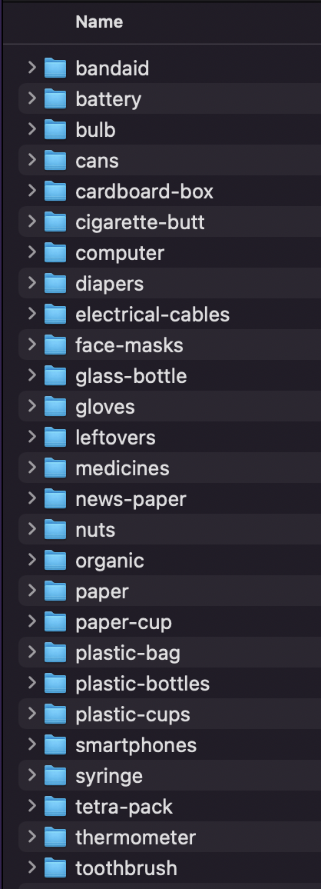
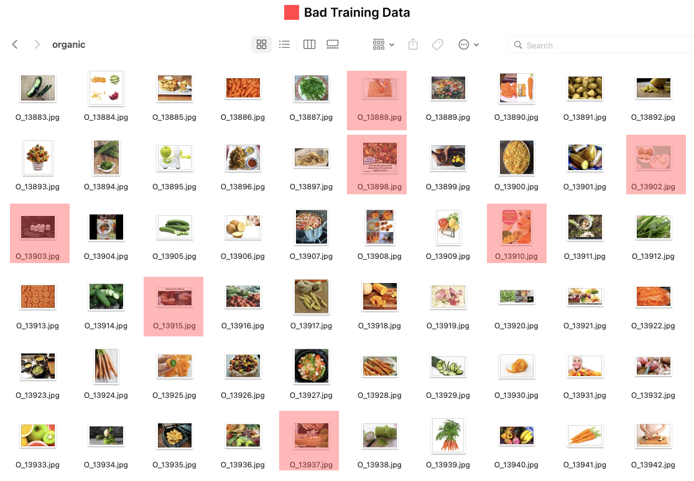
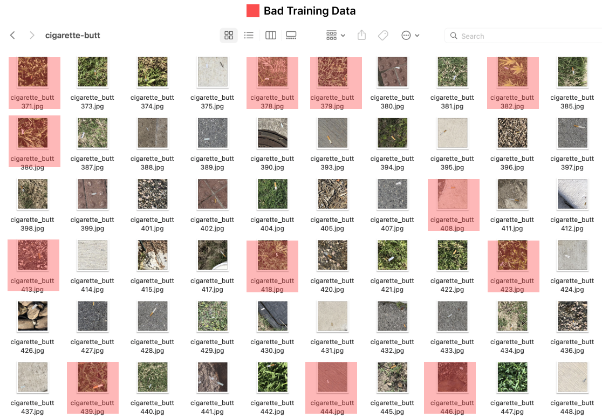

# Analysis of Dataset

The efficacy of a neural network's learning capabilities is subjective to the quality and quantity of the data it is fed and the degree of magnitude of "useful information" that it contains. These features will shape the model's algorithmic abilities to learn and in consequence, it is, therefore, critical to analyse and pre-process datasets before application. 

The analysis of a dataset should produce key insights into the quantity and quality of data available, as well as its distribution.


## 📈 Adding Data Quantity

We created a **4GB** dataset of waste images covering **27** different classes, such as batteries, bulbs, cans, cardboard boxes, etc. We put together this dataset by combining `TACO dataset`, `numerous non-annotated datasets from Kaggle/Github/etc`., and `scraping our own data` for the remaining categories from Google images.

``` 
Dataset: 44,200 items
Size: 3.91 GB
```

But this is only half the story, with just large number of training images we cannot expect the predictions would work perfectly. We need to focus on the quality of data as well.





## 🧹 Improving Data Quality


>   There’s a common adage that data scientists spend 80% of their time cleaning data and 20% modeling. With image classifiers, it is more like **90% cleaning to 10%** modeling. 

Image datasets tend to be large and cumbersome compared to text-only datasets, and training multiple models on our large dataset was a considerable time sink. 

The slow nature of the training process also meant we couldn’t ‘course correct’ in real time - we would often have to wait long periods of time for the training to complete before choosing our next steps based on the output.

Cleaning is a vital part of training an image classifier, especially with data scraped from the web is not capable of overcoming a poor dataset. We stuck to our process with the famous philosophy in Machine Learning:

```
Garbage in ----> Garbage Out
```

We have some samples of the images that were removed during the cleaning phase:






``` 
Dataset: 22,504 items
Size: 2.42 GB
```

<br>

# ✳️ Analysis of Models

Please go through our model analysis from the `analysis.ipynb` file.


### 🏁 Importance of Checkpoints

Checkpointing is of critical value when models have long training times. Training our models on the image data we had collected would often take hours to complete, meaning that any interruption or fault would result in large setbacks. Early on, we got into the habit of rigorously checkpointing our progress while training the models in order to avoid losses in case of failure.
